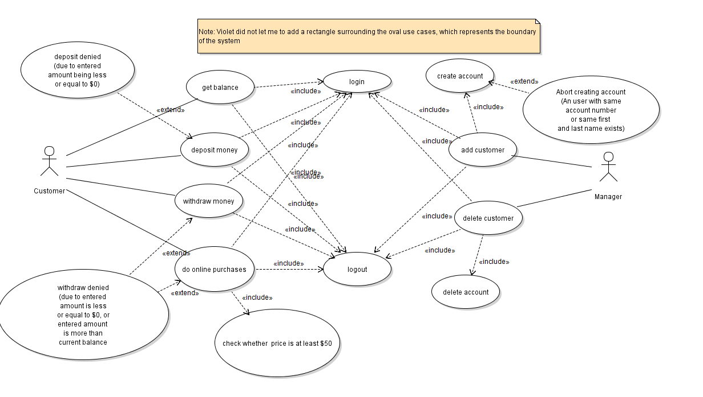
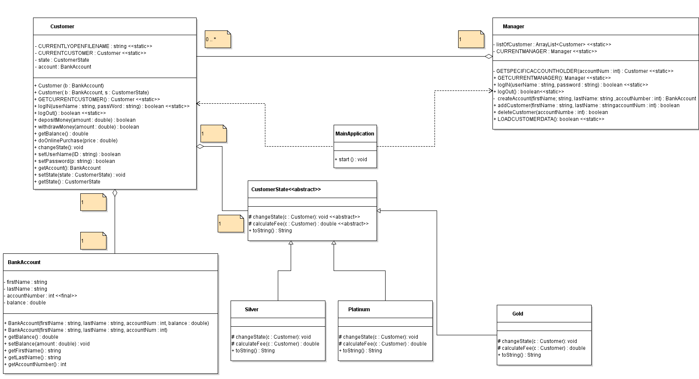

# Objective
This is a bank-account management app that offers access to two types of users: Manager, and Customer. Manager can create, add, delete account and customers. Whereas, customers can change username, password, deposit, withdraw, and do online purchases. All the relevant customer data such as username, pass, balance, etc, are stored in individual files. If you are interested to see it in action, please download the folder, and run by using an IDE. 

# Design Pattern
This project implements "State" design pattern, that is, the responsibility of the change of the level of customers lies on the concrete state classes.

See below the use case UML diagram: 

See below the Class UML diagram: 

# Important Assumptions

 * It is assumed that no two users can have same username (see the guideline)

 * It is assumed in this design that no two users can have same first name and last name , or same account number. 
   To clarify once again, no two customers can have same account number despite having different both first and last name.

 * Default username and passwords will be generated by the program when the manager creates them. Program will let you
   know these defaults when you create customers.These defaults can be changed later on by the customers
   For example during the creation if manager enters "Joe" as first name,and "Rogan" as last name, and "675" as account
   number, then default username is "JoeRogan", and the userfile is named "JoeRogan.txt"

 * Master tracker file is called "log.txt" which just lists current customers by their usernames

 * Individual userinfo. files are named by their username. These userinfo. files store everything relevant
 
 * meaning of various line of a userfile: (Counting from one)

   &nbsp;&nbsp;&nbsp;&nbsp;line 1-----> username  
   &nbsp;&nbsp;&nbsp;&nbsp;line 2-----> password  
   &nbsp;&nbsp;&nbsp;&nbsp;line 3-----> accountnumber  
   &nbsp;&nbsp;&nbsp;&nbsp;line 4-----> Balance  
   &nbsp;&nbsp;&nbsp;&nbsp;line 5-----> current state  
   &nbsp;&nbsp;&nbsp;&nbsp;line 6-----> first name  
   &nbsp;&nbsp;&nbsp;&nbsp;line 7 -----> last name
